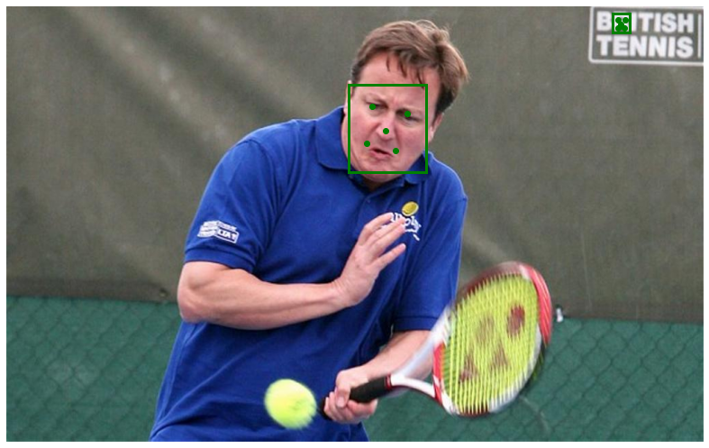
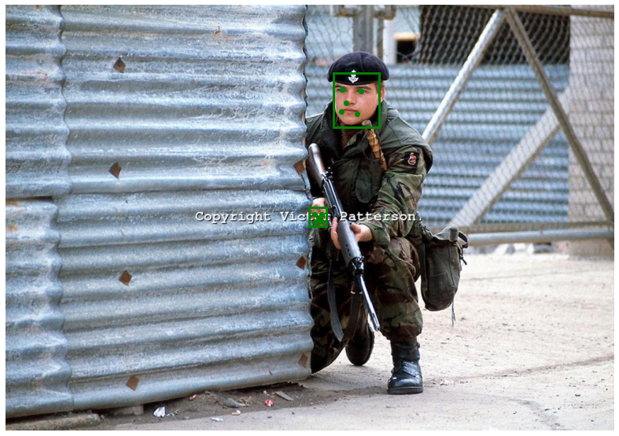
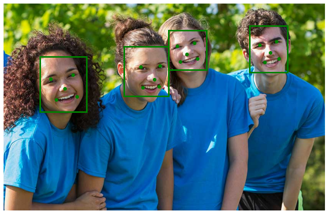
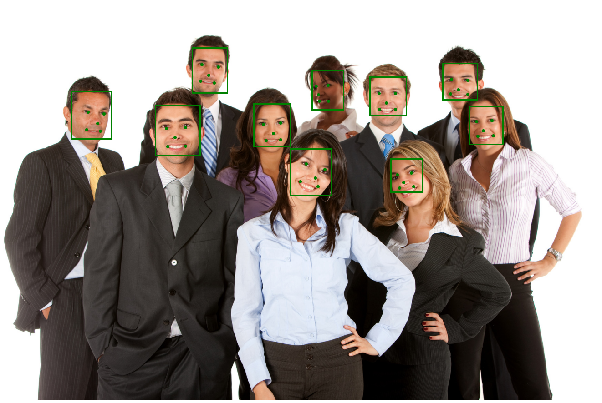

# Description
This is my attempt at trying to reproduce MTCNN, a joint face detection and alignment framework using Multi-task Cascaded Convolutional Networks. At the current state, the performance is nowhere near that of the original or other popular MTCNN implementations on Github.
# Requirement
- python 3.7
- Tensorflow 2.2
- numpy
- opencv
# Result

